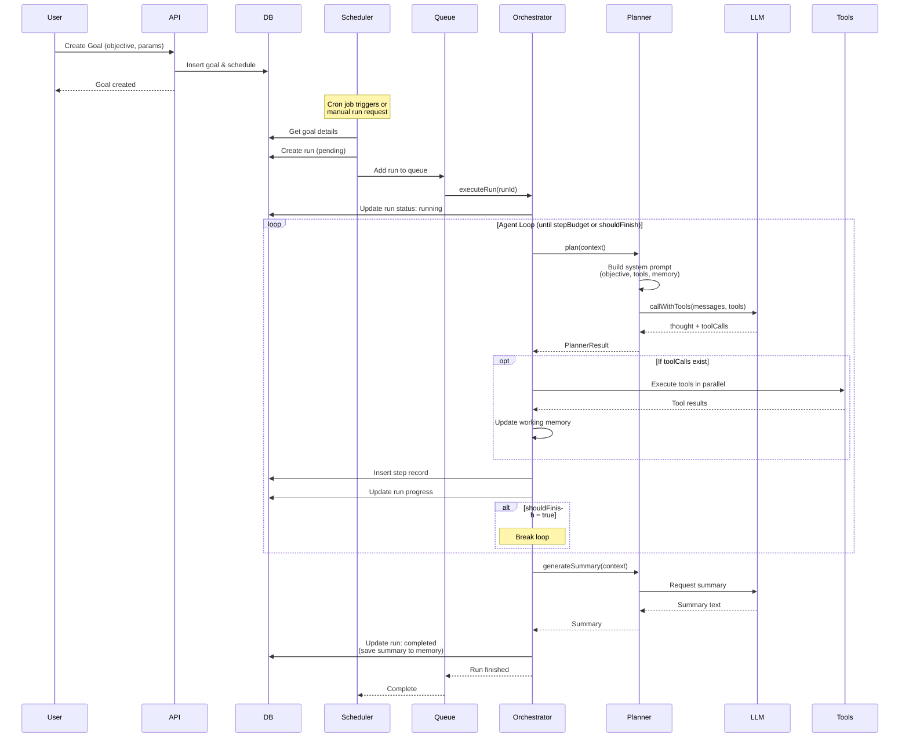
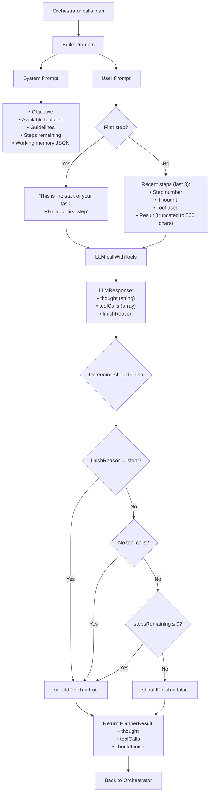

# Agent Architecture Documentation

This document explains the lifecycle of an agent from goal creation to completion, detailing the internal workings of the Planner and Orchestrator components.

## Table of Contents

- [Agent Lifecycle Overview](#agent-lifecycle-overview)
- [Components](#components)
  - [Scheduler & Queue](#scheduler--queue)
  - [Orchestrator](#orchestrator)
  - [Planner](#planner)
  - [Tool Registry](#tool-registry)
- [Detailed Flow](#detailed-flow)

---

## Agent Lifecycle Overview



### Lifecycle Phases

**1. Goal Creation**
- User creates a goal with objective and parameters via API
- Goal and optional schedule stored in database

**2. Run Triggering** ([scheduler/cron.ts](packages/backend/src/scheduler/cron.ts#L115-L158))
- Cron scheduler triggers based on schedule OR manual API call
- Creates a new run record (status: `pending`) in DB
- Queues run for execution

**3. Execution Loop** ([agent/orchestrator.ts](packages/backend/src/agent/orchestrator.ts#L24-L243))
- Updates run to `running`
- Loops until stepBudget exhausted or agent decides to finish
- Each iteration:
  - **Planner** generates thought + tool calls via LLM
  - **Tools** execute in parallel
  - **Working memory** updated with results
  - **Step** recorded in DB

**4. Completion** ([agent/orchestrator.ts](packages/backend/src/agent/orchestrator.ts#L204-L226))
- Planner generates final summary
- Run marked `completed` with summary in working memory

---

## Components

### Scheduler & Queue

#### CronScheduler ([scheduler/cron.ts](packages/backend/src/scheduler/cron.ts))

Manages scheduled and on-demand goal execution:

- **Loads active schedules** from database on startup
- **Registers cron jobs** for each schedule using `node-cron`
- **Triggers goals** either by schedule or manual API call
- **Creates runs** with `pending` status
- **Queues runs** for execution via TaskQueue

#### TaskQueue ([scheduler/queue.ts](packages/backend/src/scheduler/queue.ts))

Serial execution queue with concurrency control:

- Uses `p-queue` library (default concurrency: 1)
- Ensures runs execute sequentially
- Provides pause/resume/clear operations
- Tracks queue statistics (size, pending, paused)

**Key Method: `triggerGoal(goalId)`** ([scheduler/cron.ts#L115-L158](packages/backend/src/scheduler/cron.ts#L115-L158))

```typescript
1. Fetch goal from DB
2. Validate goal is active
3. Create run record (status: 'pending')
4. Add to queue: orchestrator.executeRun(runId)
```

---

### Orchestrator

The **AgentOrchestrator** ([agent/orchestrator.ts](packages/backend/src/agent/orchestrator.ts)) is the execution engine that coordinates the entire agent lifecycle.

#### Configuration

```typescript
interface OrchestratorConfig {
  db: Database;
  logger: Logger;
  llmProvider: LLMProvider;
  toolRegistry: ToolRegistry;
}
```

#### Main Method: `executeRun(runId)`

```mermaid
flowchart TD
    Start([executeRun called]) --> LoadRun[Load run + goal from DB]
    LoadRun --> UpdateStatus[Update status: 'running'<br/>Set startedAt timestamp]
    
    UpdateStatus --> Setup[Setup Phase]
    Setup --> FilterTools{Goal has<br/>allowedTools?}
    FilterTools -->|Yes| FilteredTools[Filter tools by names]
    FilterTools -->|No| AllTools[Use all tools]
    
    FilteredTools --> InitLoop
    AllTools --> InitLoop
    
    InitLoop[Initialize:<br/>• workingMemory from run<br/>• currentStep = 0<br/>• stepHistory = []<br/>• abortController]
    
    InitLoop --> LoopCondition{currentStep < stepBudget?}
    
    LoopCondition -->|No| PostLoop[Generate Summary]
    LoopCondition -->|Yes| IncrementStep[currentStep++]
    
    IncrementStep --> CallPlanner["planner.plan(<br/>objective, memory,<br/>history, tools)"]
    
    CallPlanner --> GetPlanResult["PlanResult:<br/>• thought<br/>• toolCalls[]<br/>• shouldFinish"]
    
    GetPlanResult --> HasTools{toolCalls exist<br/>and length > 0?}
    
    HasTools -->|No| RecordStep
    HasTools -->|Yes| ParallelExec["Promise.allSettled:<br/>Execute all tools<br/>in PARALLEL"]
    
    ParallelExec --> ValidateInputs[For each tool call:<br/>1. Get tool from registry<br/>2. Validate input with Zod<br/>3. Execute with context]
    
    ValidateInputs --> ProcessResults[Process Results]
    
    ProcessResults --> CheckResult{Result status?}
    CheckResult -->|fulfilled| AddToMemory["workingMemory:<br/>step_{n}_{tool}_{i} = result"]
    CheckResult -->|rejected| AddError[Collect error message]
    
    AddToMemory --> CombineObs[Combine observations<br/>and errors]
    AddError --> CombineObs
    
    CombineObs --> RecordStep[Save step to DB:<br/>• thought<br/>• toolName/Input<br/>• observation<br/>• duration<br/>• error]
    
    RecordStep --> UpdateHistory["stepHistory.push(<br/>step data)"]
    
    UpdateHistory --> UpdateRunDB["Update run in DB:<br/>• stepsExecuted<br/>• workingMemory"]
    
    UpdateRunDB --> ShouldFinish{planResult<br/>shouldFinish?}
    
    ShouldFinish -->|Yes| PostLoop
    ShouldFinish -->|No| LoopCondition
    
    PostLoop --> GenSummary["planner.generateSummary()"]
    GenSummary --> SaveSummary["Add summary to<br/>workingMemory"]
    SaveSummary --> MarkComplete["Update run:<br/>status = 'completed'<br/>endedAt timestamp"]
    
    MarkComplete --> Success([Return success])
    
    LoadRun -.->|Error| ErrorHandler
    UpdateStatus -.->|Error| ErrorHandler
    CallPlanner -.->|Error| ErrorHandler
    ParallelExec -.->|Error| ErrorHandler
    RecordStep -.->|Error| ErrorHandler
    
    ErrorHandler[Catch Error] --> LogError[Log error]
    LogError --> MarkFailed["Update run:<br/>status = 'failed'<br/>endedAt timestamp<br/>error message"]
    MarkFailed --> ThrowError([Throw error])
```

#### Execution Phases

##### Phase 1: Initialization ([lines 30-64](packages/backend/src/agent/orchestrator.ts#L30-L64))

1. **Load run + goal** from database
2. **Update status** to `running` with `startedAt` timestamp
3. **Filter tools**: Use `allowedTools` from goal params OR all tools
4. **Convert tools** to JSON Schema for LLM
5. **Initialize state**:
   - `workingMemory` - Persistent object from run (agent's scratchpad)
   - `currentStep = 0` - Current iteration counter
   - `stepHistory = []` - In-memory history (last 3 shown to LLM)
   - `abortController` - For cancellation support

##### Phase 2: Agent Loop ([lines 66-201](packages/backend/src/agent/orchestrator.ts#L66-L201))

**Loop Condition:** `while (currentStep < stepBudget)`

**Each Iteration:**

1. **Planning** ([lines 73-81](packages/backend/src/agent/orchestrator.ts#L73-L81))
   ```typescript
   planResult = planner.plan({
     objective, workingMemory, stepHistory,
     stepsRemaining, tools, temperature, maxTokens
   })
   // Returns: { thought, toolCalls[], shouldFinish }
   ```

2. **Tool Execution** ([lines 92-159](packages/backend/src/agent/orchestrator.ts#L92-L159))
   - **Parallel execution** via `Promise.allSettled` (NOT `Promise.all`)
   - For each tool call:
     - Get tool from registry
     - Validate input with Zod schema
     - Execute with context: `{ logger, db, runId, abortSignal }`

3. **Result Processing** ([lines 120-151](packages/backend/src/agent/orchestrator.ts#L120-L151))
   ```typescript
   if (fulfilled):
     workingMemory[`step_${n}_${toolName}_${i}`] = result
     observations.push(`[${toolName}] ${result}`)
   else:
     errors.push(`[${toolName}] Error: ${message}`)
   ```

4. **Persistence** ([lines 164-192](packages/backend/src/agent/orchestrator.ts#L164-L192))
   - Save step to DB (audit trail)
   - Update in-memory `stepHistory`
   - Update run progress in DB

5. **Exit Check** ([lines 194-198](packages/backend/src/agent/orchestrator.ts#L194-L198))
   - If `planResult.shouldFinish` → break loop

##### Phase 3: Completion ([lines 203-226](packages/backend/src/agent/orchestrator.ts#L203-L226))

1. Generate summary via `planner.generateSummary()`
2. Merge summary into working memory
3. Update run: `status = 'completed'`, `endedAt` timestamp

##### Phase 4: Error Handling ([lines 228-242](packages/backend/src/agent/orchestrator.ts#L228-L242))

Catches **any** error in entire execution:
- Logs error details
- Marks run as `failed` with error message
- Updates `endedAt` timestamp
- Rethrows (scheduler/queue handles)

#### Key Design Patterns

**1. Parallel Tool Execution**
- Uses `Promise.allSettled` (not `Promise.all`)
- Agent can call multiple tools simultaneously
- Partial failures don't block other tools
- All results (success + failure) returned

**2. Working Memory as State**
- Persistent object updated each step
- Stored in DB, passed to planner
- Agent's "scratchpad" for cumulative knowledge
- Key pattern: `step_{stepNo}_{toolName}_{index}`

**3. Error Resilience**
- Tool errors collected but don't stop execution
- Agent sees errors as observations
- Can adapt and recover in next step
- Comment at line 200: "If error, continue to next step (agent can recover)"

**4. Dual History Storage**
- `stepHistory[]`: In-memory array, passed to planner (last 3 shown to LLM)
- `steps` table: Full DB records for complete audit trail

---

### Planner

The **AgentPlanner** ([agent/planner.ts](packages/backend/src/agent/planner.ts)) acts as the agent's "brain" - it reasons about what to do next and when to finish.

#### Architecture



#### Interfaces

```typescript
interface PlannerContext {
  objective: string;
  workingMemory: Record<string, any>;
  stepHistory: Array<{
    stepNo: number;
    thought: string;
    toolName?: string;
    toolInput?: Record<string, any>;
    observation?: string;
  }>;
  stepsRemaining: number;
  tools: ToolDefinition[];
  temperature?: number;
  maxTokens?: number;
}

interface PlannerResult {
  thought: string;
  toolCalls?: Array<{
    id: string;
    name: string;
    arguments: Record<string, any>;
  }>;
  shouldFinish: boolean;
}
```

#### Key Methods

##### 1. `plan(context)` - Main Planning Loop ([lines 37-76](packages/backend/src/agent/planner.ts#L37-L76))

```typescript
async plan(context: PlannerContext): Promise<PlannerResult>
```

**Flow:**
1. Build system prompt (agent identity + context)
2. Build user prompt (first step or recent history)
3. Call LLM with tools enabled
4. Determine if should finish
5. Return thought + tool calls + finish decision

**Finish Logic** ([lines 61-65](packages/backend/src/agent/planner.ts#L61-L65)):

Agent finishes when **ANY** of:
- LLM returns `finishReason: 'stop'` (natural completion)
- No tool calls returned (nothing left to do)
- Step budget exhausted (`stepsRemaining <= 0`)

##### 2. `buildSystemPrompt(context)` - Agent Identity ([lines 78-96](packages/backend/src/agent/planner.ts#L78-L96))

Constructs the agent's core instruction set:

```
You are an autonomous AI agent designed to achieve goals...

Your objective: <objective>

Available tools:
- tool1: description
- tool2: description

Guidelines:
1. Think step-by-step to achieve the objective
2. Use tools to gather information, perform actions, and generate outputs
3. Keep track of what you've learned in working memory
4. When you have sufficient information or completed the task, provide a final summary
5. Be concise and focused on the objective
6. You have N steps remaining in your budget

Working memory (your scratchpad):
<JSON of working memory>
```

##### 3. `buildUserPrompt(context)` - Contextual Guidance ([lines 98-119](packages/backend/src/agent/planner.ts#L98-L119))

**First Step** (stepHistory.length === 0):
```
This is the start of your task. Plan your first step to achieve the objective.
```

**Subsequent Steps**:
```
Recent steps:
Step N: <thought>
Tool used: <toolName>
Result: <observation (truncated to 500 chars)>

Step N+1: ...

Based on what you've learned, what should be your next step?
If you have enough information to complete the objective, provide a final summary and finish.
```

**Context Window Management:**
- Only last **3 steps** shown to LLM (prevents token explosion)
- Observations truncated to **500 characters** in user prompt
- Full state preserved in working memory JSON

##### 4. `generateSummary(context)` - Final Report ([lines 121-152](packages/backend/src/agent/planner.ts#L121-L152))

Called after agent finishes execution:

```typescript
async generateSummary(context: PlannerContext): Promise<string>
```

**Characteristics:**
- Uses **lower temperature** (`temperature * 0.7`) for focused output
- Uses **half the tokens** (`maxTokens / 2`)
- **No tools** available (just text generation)
- Observations truncated to **200 characters**
- Fallback: Returns error message if summary generation fails

**Prompt Structure:**
```
Given the following objective and execution history, provide a concise summary of what was accomplished:

Objective: <objective>

Execution history:
- Step 1: <thought>
  Result: <observation (200 chars)>
- Step 2: ...

Working memory:
<JSON>

Provide a clear, concise summary of what was accomplished and any key findings or outputs.
```

---

### Tool Registry

The **ToolRegistry** ([agent/tools/index.ts](packages/backend/src/agent/tools/index.ts)) manages available tools for the agent.

#### Default Tools

- `WebSearchTool` - Search the web
- `FetchPageTool` - Fetch web page content
- `WriteFileTool` - Write files to artifacts directory
- `ReadFileTool` - Read files from artifacts directory
- `SendWebhookTool` - Send HTTP webhooks
- `SendEmailTool` - Send emails

#### Key Methods

```typescript
register(tool: Tool): void              // Register a new tool
get(name: string): Tool | undefined     // Get tool by name
getAll(): Tool[]                        // Get all tools
getAllDefinitions(): ToolDefinition[]   // Get all as JSON schemas
hasTool(name: string): boolean          // Check if tool exists
filterByNames(names?: string[]): Tool[] // Filter by allowedTools
```

#### Tool Interface

Each tool implements:

```typescript
interface Tool {
  name: string;
  description: string;
  inputSchema: ZodSchema;
  
  toJSONSchema(): ToolDefinition;
  
  execute(input: any, context: {
    logger: Logger;
    db: Database;
    runId: string;
    abortSignal?: AbortSignal;
  }): Promise<any>;
}
```

---

## Detailed Flow

### Complete Execution Example

```
1. USER CREATES GOAL
   ├─ API: POST /goals { objective: "Research AI trends", schedule: "0 9 * * *" }
   ├─ DB: Insert goal (id: goal_123, status: active)
   └─ DB: Insert schedule (cronExpr: "0 9 * * *")

2. SCHEDULER TRIGGERS (9 AM daily)
   ├─ CronScheduler: Cron job fires
   ├─ DB: Create run (id: run_456, status: pending, stepBudget: 10)
   └─ Queue: Add task { id: run_456, execute: orchestrator.executeRun }

3. ORCHESTRATOR EXECUTES
   ├─ DB: Update run (status: running, startedAt: now)
   ├─ Filter tools (all 6 tools available)
   └─ Initialize: workingMemory={}, currentStep=0, stepHistory=[]

4. STEP 1
   ├─ Planner.plan()
   │  ├─ SystemPrompt: "You are an autonomous AI agent... objective: Research AI trends"
   │  ├─ UserPrompt: "This is the start of your task. Plan your first step."
   │  └─ LLM Response: thought="I'll search for recent AI trends", toolCalls=[{name: "webSearch", args: {query: "AI trends 2024"}}]
   ├─ Execute: webSearch("AI trends 2024") → results
   ├─ Update: workingMemory.step_1_webSearch_0 = results
   ├─ DB: Insert step (stepNo: 1, thought: "...", observation: "...")
   ├─ Update: stepHistory.push({...})
   ├─ DB: Update run (stepsExecuted: 1, workingMemory: {...})
   └─ shouldFinish = false → continue

5. STEP 2
   ├─ Planner.plan()
   │  ├─ SystemPrompt: (updated with workingMemory)
   │  ├─ UserPrompt: "Recent steps: Step 1: I'll search... Tool used: webSearch, Result: ..."
   │  └─ LLM Response: thought="I'll fetch details from top article", toolCalls=[{name: "fetchPage", args: {url: "..."}}]
   ├─ Execute: fetchPage(url) → content
   ├─ Update: workingMemory.step_2_fetchPage_0 = content
   ├─ DB: Insert step
   └─ Continue...

6. STEP N (final)
   ├─ Planner.plan()
   │  └─ LLM Response: thought="Summary of AI trends...", toolCalls=undefined, finishReason="stop"
   ├─ shouldFinish = true → break loop
   ├─ Planner.generateSummary()
   │  └─ Returns: "Researched AI trends for 2024. Key findings: ..."
   ├─ DB: Update run (status: completed, endedAt: now, workingMemory: {...summary})
   └─ Return success

7. RESULT
   └─ User can query: GET /runs/run_456/steps to see full execution history
```

---

## Key Takeaways

### Design Principles

1. **Stateful Execution**
   - Working memory persists across steps
   - Agent builds knowledge incrementally
   - Can resume from failures

2. **Parallel Tool Execution**
   - Multiple tools run simultaneously
   - Faster execution
   - Resilient to partial failures

3. **Context Window Optimization**
   - Only recent steps shown to LLM
   - Observations truncated
   - Full history in database

4. **Error Resilience**
   - Tool failures don't crash runs
   - Agent sees errors and can adapt
   - Graceful degradation

5. **Budget-Aware Planning**
   - Steps remaining communicated to LLM
   - Prevents infinite loops
   - Encourages efficient planning

### Data Flow

```
Goal → Run → Steps
  ↓      ↓      ↓
  DB     DB     DB

Working Memory: Goal Params → Run State → Updated Each Step → Final Summary
Step History:   In-Memory → Last 3 to LLM → Full in DB
```

### Performance Characteristics

- **Concurrency**: 1 run at a time (configurable via TaskQueue)
- **Parallelism**: Multiple tools per step
- **Persistence**: Every step saved to DB
- **Recovery**: Can inspect working memory to resume
- **Observability**: Full audit trail in database

---

## File References

- **Orchestrator**: [packages/backend/src/agent/orchestrator.ts](packages/backend/src/agent/orchestrator.ts)
- **Planner**: [packages/backend/src/agent/planner.ts](packages/backend/src/agent/planner.ts)
- **Scheduler**: [packages/backend/src/scheduler/cron.ts](packages/backend/src/scheduler/cron.ts)
- **Queue**: [packages/backend/src/scheduler/queue.ts](packages/backend/src/scheduler/queue.ts)
- **Tool Registry**: [packages/backend/src/agent/tools/index.ts](packages/backend/src/agent/tools/index.ts)
- **LLM Providers**: [packages/backend/src/agent/providers/](packages/backend/src/agent/providers/)
